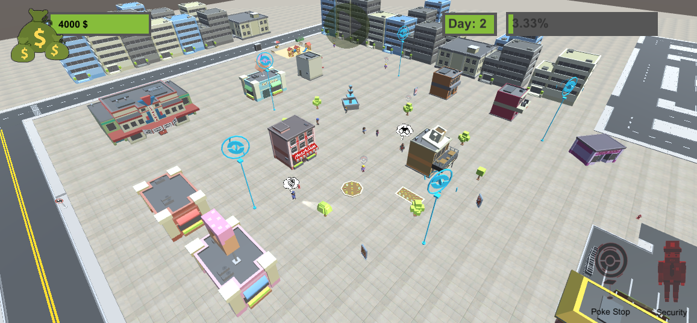

# Welcome to WallSmart

WallSmart is an artificial intelligence oriented game where you have to build your own Mall, with limited space and money. Your objective through the game is to sustain that mall at the same time that you manage to keep it safe aswell you return the credit to the bank.

# Authors

- [Marc Fabian](https://github.com/xDragan)
- [Albert Llopart](https://github.com/albertllopart/)

# Bitbucket

[Click Me](https://bitbucket.org/citmturtles/wallsmart.git)

# Gameplay

The gameplay is solely based on taking decisions that will affect the environment. You can purchase shops for your customers, PokéStops to attract Pokémon go players or Security Guards to ensure the safety of your mall. Whenever a day goes by the game will be paused giving you the chance to take those desicions. When you're ready to face the next day just click Resume. If you reach 100% of the money needed to pay your debts you will beat the game! However, if you run out of time and you still have the debt, you will lose!

# Controls

As far as controls go, you can move the camera with ASDW, and change its height with RF. The rest is all about clicking!

# NPCs

### Pokémon Go Player
They are little girls that will roam around your mall looking for PokéStops, a special building that you can purchase using your UI. Every time they reach one they will give you money. If they fail to find a PokéStop they will flee home. They will also flee when night comes or if their mobile phone gets stolen, so be careful with thieves around.

### Thief
They will wander around your mall looking for Pokémon Go Players to rob their mobile phones, causing them to flee home while being unable to earn money for the player. If you are having trouble with them, consider hiring some security, using your UI!

### Police Man
They will patrol by following a path that goes all around the mall looking for thieves. If they spot one with their lantern, they will signal the thieve to go away with a whistle. Then that thief will flee out of your mall so the Pokémon Go Players can keep on looking for PokéStops with safety!

### Customer
They will head to the center of your mall only to decide then what are they going to buy! If they can find what they are looking for they will give you some money, but if they can't they will return home empty handed with full pockets.

# Some Rules

This is your own personal mall, but still there are some rules that you cannot control!

- The more PokéStops you build, the faster Pokémon Go Players will spawn.
- Customers have random preferences, so maybe they don't like the shops that you have built. It's up to you do find out what are their likes. Maybe try guessing them by looking at their appearence? Don't need to judge them, though.
- You can only build at night, so think well your next purchase during the day while you observe the chaos that you're creating!

# License

MIT License

Copyright (c) 2018 

Permission is hereby granted, free of charge, to any person obtaining a copy
of this software and associated documentation files (the "Software"), to deal
in the Software without restriction, including without limitation the rights
to use, copy, modify, merge, publish, distribute, sublicense, and/or sell
copies of the Software, and to permit persons to whom the Software is
furnished to do so, subject to the following conditions:

The above copyright notice and this permission notice shall be included in all
copies or substantial portions of the Software.

THE SOFTWARE IS PROVIDED "AS IS", WITHOUT WARRANTY OF ANY KIND, EXPRESS OR
IMPLIED, INCLUDING BUT NOT LIMITED TO THE WARRANTIES OF MERCHANTABILITY,
FITNESS FOR A PARTICULAR PURPOSE AND NONINFRINGEMENT. IN NO EVENT SHALL THE
AUTHORS OR COPYRIGHT HOLDERS BE LIABLE FOR ANY CLAIM, DAMAGES OR OTHER
LIABILITY, WHETHER IN AN ACTION OF CONTRACT, TORT OR OTHERWISE, ARISING FROM,
OUT OF OR IN CONNECTION WITH THE SOFTWARE OR THE USE OR OTHER DEALINGS IN THE
SOFTWARE.

Having trouble with Pages? Check out our [documentation](https://help.github.com/categories/github-pages-basics/) or [contact support](https://github.com/contact) and we’ll help you sort it out.
